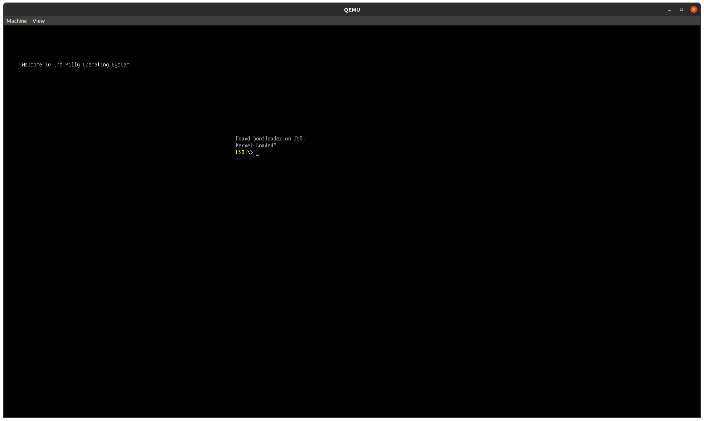

# MillyOS
A minimal, but complete operating system, written from scratch.

A preview of the program

=========================================================================

## What is?
Is the source code of Milly Operating System

## What can i do with it?
You can compile, contribute, and ristribuite the source code!

=========================================================================

## What this program focuses on?
A basic programming language that help you, and automatize your development, with saving time!

=========================================================================

## BEFORE START!!
As i have explained in the DickyLang repository, you need Bash, and GCC(obbviously to run the code). And i have created a guide to install GCC, to another distributions. (https://github.com/simone-ciardo/DickyLang/blob/main/README.md)

=========================================================================

## Licenses
The program is under GNU/GPL License 3.0.

### Credits
* simone-ciardo: The developer of this project(https://github.com/simone-ciardo).
* Absurdponcho:  The implementator of the kernel(https://github.com/Absurdponcho).
